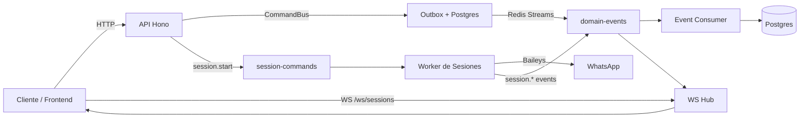
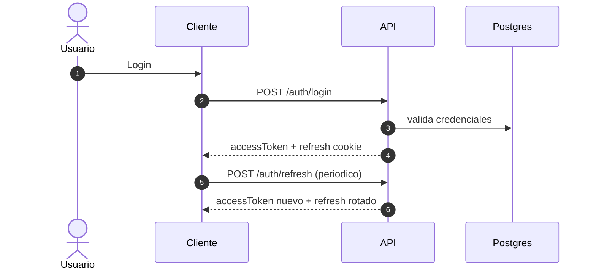
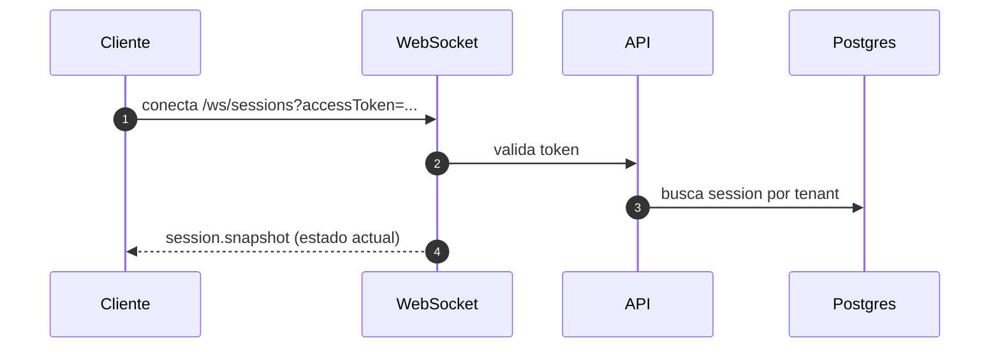
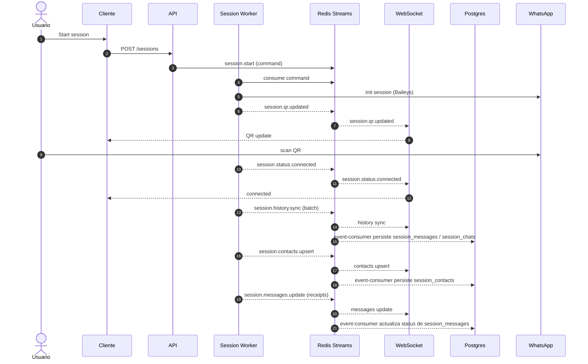
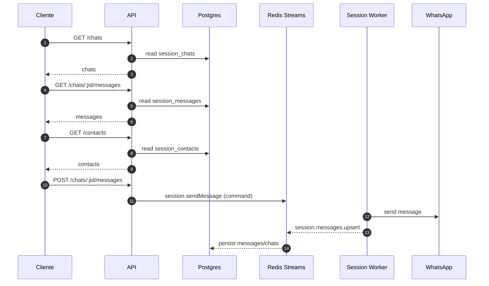

# Flujos y diagrama de la app

La app es un backend para gestionar sesiones de WhatsApp (via Baileys), con autenticacion propia, persistencia en Postgres y eventos por Redis Streams. Expone API HTTP para usuarios/sesiones/chats y un WebSocket para eventos en tiempo real del tenant autenticado.

## WebSocket (real-time)
URL:
```
ws://<host>/ws/sessions?accessToken=<token>
```

Eventos emitidos por tenant:
- `session.snapshot` (al conectar WS)
- `session.created`
- `session.qr.updated`
- `session.status.connected`
- `session.status.disconnected`
- `session.history.sync`
- `session.messages.upsert`
- `session.messages.update`
- `session.contacts.upsert`

## Endpoints principales

Auth:
- `POST /auth/login`
- `POST /auth/refresh`
- `POST /auth/logout`
- `POST /auth/logout-all`
- `POST /auth/resend-verification`
- `POST /auth/password-reset`
- `POST /auth/password-reset/confirm`

Users:
- `POST /users`
- `POST /users/:id/verify`
- `GET /users/me`

Sessions (WhatsApp):
- `POST /sessions`
- `POST /sessions/:id/stop`
- `DELETE /sessions/:id`
- `POST /sessions/:id/messages`

Chats:
- `GET /chats`
- `GET /chats/:jid/messages`
- `POST /chats/:jid/messages`

Contacts:
- `GET /contacts`

Metrics:
- `GET /metrics` (si esta habilitado)

## Diagrama de arquitectura (alto nivel)


## Flujo de login y autenticacion


## Flujo de WS snapshot inicial


## Flujo de sesion WhatsApp y sync


## Flujo de chats, contactos y mensajes (API)

