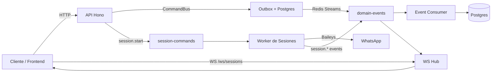
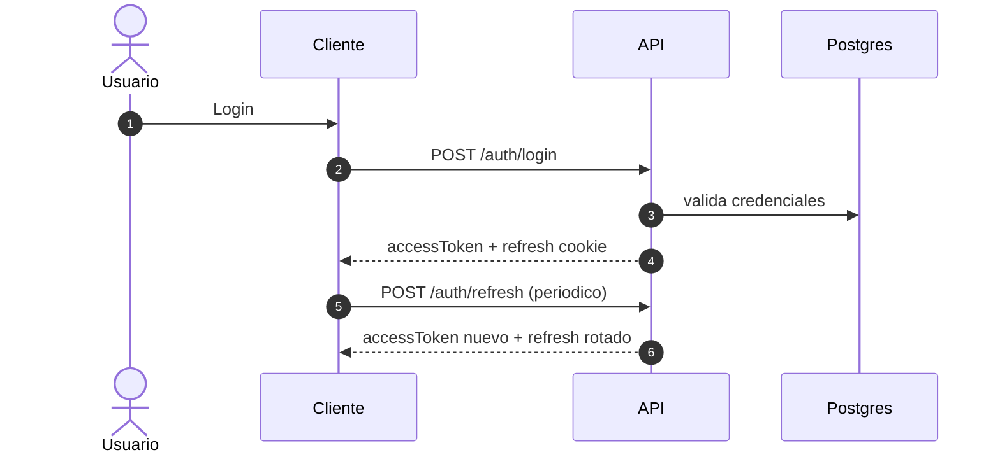
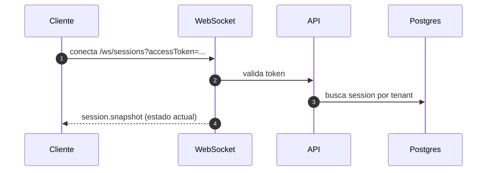
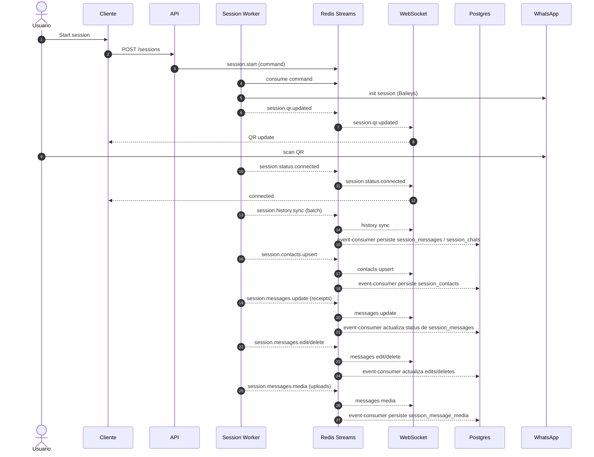
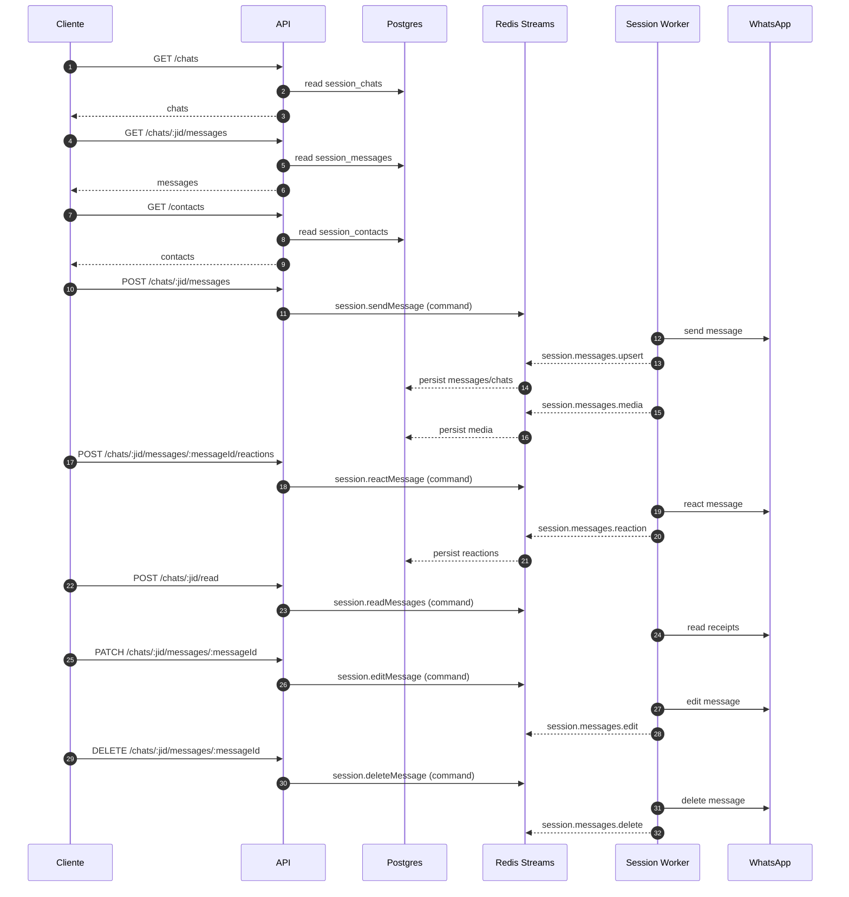

# Flujos y diagrama de la app

La app es un backend para gestionar sesiones de WhatsApp (via Baileys), con autenticacion propia, persistencia en Postgres y eventos por Redis Streams. Expone API HTTP para usuarios/sesiones/chats y un WebSocket para eventos en tiempo real del tenant autenticado.

## WebSocket (real-time)
URL:
```
ws://<host>/ws/sessions?accessToken=<token>
```

Eventos emitidos por tenant:
- `session.snapshot` (al conectar WS)
- `session.created`
- `session.qr.updated`
- `session.status.connected`
- `session.status.disconnected`
- `session.history.sync`
- `session.messages.upsert`
- `session.messages.update`
- `session.messages.edit`
- `session.messages.delete`
- `session.messages.reaction`
- `session.messages.media`
- `session.contacts.upsert`
- `session.presence.update`

Formato base:
```json
{
  "type": "session.qr.updated",
  "sessionId": "<uuid>",
  "eventId": "<uuid>",
  "occurredOn": "2026-01-01T00:00:00.000Z",
  "payload": {}
}
```

Resumen de payloads:
- `session.snapshot`: `{ tenantId, session: SessionPrimitives | null }`
- `session.created`: `{ tenantId, id, status, createdAt }`
- `session.qr.updated`: `{ tenantId, qr, expiresAt }`
- `session.status.connected`: `{ tenantId, phone, connectedAt }`
- `session.status.disconnected`: `{ tenantId, reason, disconnectedAt }`
- `session.history.sync`: `{ tenantId, syncType, progress, isLatest, chatsCount, contactsCount, messagesCount, messagesTruncated, messages[] }`
- `session.messages.upsert`: `{ tenantId, upsertType, requestId, messagesCount, messages[] }`
- `session.messages.update`: `{ tenantId, updatesCount, updates[] }`
- `session.messages.edit`: `{ tenantId, editsCount, edits[] }`
- `session.messages.delete`: `{ tenantId, scope, chatJid?, deletesCount, deletes[] }`
- `session.messages.reaction`: `{ tenantId, reactionsCount, reactions[] }`
- `session.messages.media`: `{ tenantId, mediaCount, media[] }`
- `session.contacts.upsert`: `{ tenantId, contactsCount, contactsTruncated, contacts[] }`
- `session.presence.update`: `{ tenantId, chatJid, updatesCount, updates[] }`

Notas:
- `messages[]` trae resumen y `raw` opcional si se persistio en DB.
- `updates[]` suele incluir `messageId`, `status` y `statusAt` (delivered/read/played).
- `edits[]` incluye `messageId`, `text`, `type`, `editedAt`.
- `deletes[]` incluye `messageId` y `deletedAt` (scope `message`), o `scope=chat` para limpieza masiva.
- `reactions[]` incluye `messageId`, `emoji`, `actorJid`, `reactedAt` y `removed`.
- `media[]` incluye `messageId`, `kind`, `url`, `mime`, `size`, `width`, `height`, `duration`.
- `presence.update` trae `presence` (composing/available/unavailable/paused) y `lastSeen` cuando aplica.

## Ejemplos de eventos WS (payload real)

session.snapshot:
```json
{
  "type": "session.snapshot",
  "sessionId": "4b1a9c08-6b70-4c1c-9d5b-2b7d8fd5b901",
  "eventId": "9c2a5fe8-645e-4f6f-a05f-0a6a0a2f9d3d",
  "occurredOn": "2026-01-01T00:00:00.000Z",
  "payload": {
    "tenantId": "9e3a5b9c-56b9-4b8d-9e2b-5c3a1f4b9a12",
    "session": {
      "id": "4b1a9c08-6b70-4c1c-9d5b-2b7d8fd5b901",
      "tenantId": "9e3a5b9c-56b9-4b8d-9e2b-5c3a1f4b9a12",
      "status": "connected",
      "phone": "51999999999",
      "qr": null,
      "qrExpiresAt": null,
      "connectedAt": "2026-01-01T00:00:00.000Z",
      "disconnectedAt": null,
      "disconnectedReason": null,
      "createdAt": "2026-01-01T00:00:00.000Z",
      "updatedAt": "2026-01-01T00:00:00.000Z"
    }
  }
}
```

session.qr.updated:
```json
{
  "type": "session.qr.updated",
  "sessionId": "4b1a9c08-6b70-4c1c-9d5b-2b7d8fd5b901",
  "payload": { "tenantId": "9e3a5b9c-56b9-4b8d-9e2b-5c3a1f4b9a12", "qr": "<base64>", "expiresAt": "2026-01-01T00:01:00.000Z" }
}
```

session.status.connected:
```json
{
  "type": "session.status.connected",
  "sessionId": "4b1a9c08-6b70-4c1c-9d5b-2b7d8fd5b901",
  "payload": { "tenantId": "9e3a5b9c-56b9-4b8d-9e2b-5c3a1f4b9a12", "phone": "51999999999", "connectedAt": "2026-01-01T00:02:00.000Z" }
}
```

session.history.sync:
```json
{
  "type": "session.history.sync",
  "sessionId": "4b1a9c08-6b70-4c1c-9d5b-2b7d8fd5b901",
  "payload": {
    "tenantId": "9e3a5b9c-56b9-4b8d-9e2b-5c3a1f4b9a12",
    "syncType": "RECENT",
    "progress": 55,
    "isLatest": false,
    "chatsCount": 120,
    "contactsCount": 300,
    "messagesCount": 500,
    "messagesTruncated": true,
    "messages": [
      {
        "id": "msg-1",
        "remoteJid": "51999999999@s.whatsapp.net",
        "fromMe": false,
        "timestamp": 1767220000,
        "type": "conversation",
        "text": "Hola"
      }
    ]
  }
}
```

session.messages.upsert:
```json
{
  "type": "session.messages.upsert",
  "sessionId": "4b1a9c08-6b70-4c1c-9d5b-2b7d8fd5b901",
  "payload": {
    "tenantId": "9e3a5b9c-56b9-4b8d-9e2b-5c3a1f4b9a12",
    "upsertType": "notify",
    "messagesCount": 1,
    "messages": [
      {
        "id": "msg-2",
        "remoteJid": "51999999999@s.whatsapp.net",
        "fromMe": false,
        "timestamp": 1767220050,
        "type": "conversation",
        "text": "Como estas?"
      }
    ]
  }
}
```

session.messages.update (status):
```json
{
  "type": "session.messages.update",
  "sessionId": "4b1a9c08-6b70-4c1c-9d5b-2b7d8fd5b901",
  "payload": {
    "tenantId": "9e3a5b9c-56b9-4b8d-9e2b-5c3a1f4b9a12",
    "updatesCount": 1,
    "updates": [
      { "messageId": "msg-2", "status": "read", "statusAt": 1767220060 }
    ],
    "source": "receipt"
  }
}
```

session.messages.edit:
```json
{
  "type": "session.messages.edit",
  "sessionId": "4b1a9c08-6b70-4c1c-9d5b-2b7d8fd5b901",
  "payload": {
    "tenantId": "9e3a5b9c-56b9-4b8d-9e2b-5c3a1f4b9a12",
    "editsCount": 1,
    "edits": [
      { "messageId": "msg-2", "type": "conversation", "text": "Como estas hoy?", "editedAt": 1767220070 }
    ]
  }
}
```

session.messages.delete (message):
```json
{
  "type": "session.messages.delete",
  "sessionId": "4b1a9c08-6b70-4c1c-9d5b-2b7d8fd5b901",
  "payload": {
    "tenantId": "9e3a5b9c-56b9-4b8d-9e2b-5c3a1f4b9a12",
    "scope": "message",
    "deletesCount": 1,
    "deletes": [
      { "messageId": "msg-2", "deletedAt": 1767220080 }
    ]
  }
}
```

session.messages.delete (chat):
```json
{
  "type": "session.messages.delete",
  "sessionId": "4b1a9c08-6b70-4c1c-9d5b-2b7d8fd5b901",
  "payload": {
    "tenantId": "9e3a5b9c-56b9-4b8d-9e2b-5c3a1f4b9a12",
    "scope": "chat",
    "chatJid": "51999999999@s.whatsapp.net",
    "deletesCount": 0,
    "deletes": []
  }
}
```

session.messages.reaction:
```json
{
  "type": "session.messages.reaction",
  "sessionId": "4b1a9c08-6b70-4c1c-9d5b-2b7d8fd5b901",
  "payload": {
    "tenantId": "9e3a5b9c-56b9-4b8d-9e2b-5c3a1f4b9a12",
    "reactionsCount": 1,
    "reactions": [
      {
        "messageId": "msg-2",
        "chatJid": "51999999999@s.whatsapp.net",
        "actorJid": "51999999999@s.whatsapp.net",
        "fromMe": false,
        "emoji": "👍",
        "reactedAt": 1767220090,
        "removed": false
      }
    ],
    "source": "event"
  }
}
```

session.messages.media:
```json
{
  "type": "session.messages.media",
  "sessionId": "4b1a9c08-6b70-4c1c-9d5b-2b7d8fd5b901",
  "payload": {
    "tenantId": "9e3a5b9c-56b9-4b8d-9e2b-5c3a1f4b9a12",
    "mediaCount": 1,
    "media": [
      {
        "messageId": "msg-3",
        "chatJid": "51999999999@s.whatsapp.net",
        "kind": "image",
        "url": "https://anna-media.<account-id>.r2.dev/tenants/tenant-1/sessions/session-1/messages/msg-3/photo.jpg",
        "mime": "image/jpeg",
        "size": 120483,
        "width": 720,
        "height": 1280,
        "duration": null
      }
    ],
    "source": "event"
  }
}
```

session.contacts.upsert:
```json
{
  "type": "session.contacts.upsert",
  "sessionId": "4b1a9c08-6b70-4c1c-9d5b-2b7d8fd5b901",
  "payload": {
    "tenantId": "9e3a5b9c-56b9-4b8d-9e2b-5c3a1f4b9a12",
    "contactsCount": 2,
    "contactsTruncated": false,
    "contacts": [
      { "id": "51999999999@s.whatsapp.net", "name": "Ada", "notify": "Ada", "imgUrl": null },
      { "id": "51888888888@s.whatsapp.net", "notify": "Grace", "imgUrl": null }
    ],
    "source": "event"
  }
}
```

session.presence.update:
```json
{
  "type": "session.presence.update",
  "sessionId": "4b1a9c08-6b70-4c1c-9d5b-2b7d8fd5b901",
  "payload": {
    "tenantId": "9e3a5b9c-56b9-4b8d-9e2b-5c3a1f4b9a12",
    "chatJid": "51999999999@s.whatsapp.net",
    "updatesCount": 1,
    "updates": [
      { "jid": "51999999999@s.whatsapp.net", "presence": "composing", "lastSeen": null }
    ]
  }
}
```

## Endpoints principales

Auth:
- `POST /auth/login`
- `POST /auth/refresh`
- `POST /auth/logout`
- `POST /auth/logout-all`
- `POST /auth/resend-verification`
- `POST /auth/password-reset`
- `POST /auth/password-reset/confirm`

Users:
- `POST /users`
- `POST /users/:id/verify`
- `GET /users/me`

Sessions (WhatsApp):
- `POST /sessions`
- `POST /sessions/:id/stop`
- `DELETE /sessions/:id`
- `POST /sessions/:id/messages`

Chats:
- `GET /chats`
- `GET /chats/:jid/messages`
- `POST /chats/:jid/messages`

Media:
- `POST /media` (multipart: file + kind + sessionId opcional)
- `POST /chats/:jid/read`
- `PATCH /chats/:jid/messages/:messageId`
- `DELETE /chats/:jid/messages/:messageId`
- `POST /chats/:jid/messages/:messageId/reactions`

Contacts:
- `GET /contacts`

Metrics:
- `GET /metrics` (si esta habilitado)

## Reacciones (backend)

Acciones:
- Agregar/actualizar reaccion: `POST /chats/:jid/messages/:messageId/reactions` con `{ "emoji": "👍" }`.
- Quitar reaccion: enviar `{ "emoji": null }` (remueve tu reaccion sobre ese mensaje).

WS:
- Evento `session.messages.reaction` con `reactions[]` (`messageId`, `chatJid`, `actorJid`, `emoji`, `reactedAt`, `removed`).
- `removed=true` cuando se quita una reaccion.

Respuesta API:
- `GET /chats/:jid/messages` incluye `reactions` por mensaje, agregadas por emoji.

Ejemplo de mensaje con reacciones (API):
```json
{
  "id": "msg-2",
  "text": "Hola",
  "reactions": [
    { "emoji": "👍", "count": 2, "actors": ["51999999999@s.whatsapp.net", "51888888888@s.whatsapp.net"] },
    { "emoji": "❤️", "count": 1, "actors": ["51999999999@s.whatsapp.net"] }
  ]
}
```

## Media (backend)

Soportado:
- `image`, `video`, `audio`, `document`, `sticker` (webp).
Almacenamiento:
- Sube a S3/R2 (`S3_*`) y entrega `media.url` (usa `S3_PUBLIC_BASE_URL` para URL publica).

WS:
- Evento `session.messages.media` con `media[]` (`messageId`, `chatJid`, `kind`, `url`, `mime`, `size`, `width`, `height`, `duration`).

Respuesta API:
- `GET /chats/:jid/messages` incluye `media` cuando el backend termina de subir a S3/R2.

Ejemplo de mensaje con media (API):
```json
{
  "id": "msg-3",
  "type": "imageMessage",
  "text": "Foto",
  "media": {
    "kind": "image",
    "url": "https://anna-media.<account-id>.r2.dev/tenants/tenant-1/sessions/session-1/messages/msg-3/photo.jpg",
    "mime": "image/jpeg",
    "size": 120483,
    "width": 720,
    "height": 1280,
    "duration": null
  }
}
```

## Ejemplos de endpoints (frontend)

Login:
```bash
curl -X POST http://localhost:3000/auth/login \
  -H 'Content-Type: application/json' \
  -d '{"email":"ada@example.com","password":"SuperSecure123!"}'
```

Conectar WS:
```
ws://localhost:3000/ws/sessions?accessToken=<token>
```

Listar chats:
```bash
curl http://localhost:3000/chats \
  -H 'Authorization: Bearer <accessToken>'
```

Listar mensajes (paginado):
```bash
curl "http://localhost:3000/chats/<jid>/messages?limit=50&cursor=<cursor>" \
  -H 'Authorization: Bearer <accessToken>'
```

Enviar mensaje:
```bash
curl -X POST http://localhost:3000/chats/<jid>/messages \
  -H 'Authorization: Bearer <accessToken>' \
  -H 'Content-Type: application/json' \
  -d '{"content":"Hola!"}'
```

Reply:
```bash
curl -X POST http://localhost:3000/chats/<jid>/messages \
  -H 'Authorization: Bearer <accessToken>' \
  -H 'Content-Type: application/json' \
  -d '{"content":"Respuesta","replyToMessageId":"<messageId>"}'
```

Forward:
```bash
curl -X POST http://localhost:3000/chats/<jid>/messages \
  -H 'Authorization: Bearer <accessToken>' \
  -H 'Content-Type: application/json' \
  -d '{"forwardMessageId":"<messageId>"}'
```

Marcar como leido:
```bash
curl -X POST http://localhost:3000/chats/<jid>/read \
  -H 'Authorization: Bearer <accessToken>' \
  -H 'Content-Type: application/json' \
  -d '{"messageIds":["<messageId>"]}'
```

Editar:
```bash
curl -X PATCH http://localhost:3000/chats/<jid>/messages/<messageId> \
  -H 'Authorization: Bearer <accessToken>' \
  -H 'Content-Type: application/json' \
  -d '{"content":"Texto editado"}'
```

Borrar:
```bash
curl -X DELETE http://localhost:3000/chats/<jid>/messages/<messageId> \
  -H 'Authorization: Bearer <accessToken>'
```

Reaccionar:
```bash
curl -X POST http://localhost:3000/chats/<jid>/messages/<messageId>/reactions \
  -H 'Authorization: Bearer <accessToken>' \
  -H 'Content-Type: application/json' \
  -d '{"emoji":"👍"}'
```

Quitar reaccion:
```bash
curl -X POST http://localhost:3000/chats/<jid>/messages/<messageId>/reactions \
  -H 'Authorization: Bearer <accessToken>' \
  -H 'Content-Type: application/json' \
  -d '{"emoji":null}'
```

Listar contactos:
```bash
curl http://localhost:3000/contacts \
  -H 'Authorization: Bearer <accessToken>'
```

## Diagrama de arquitectura (alto nivel)


## Flujo de login y autenticacion


## Flujo de WS snapshot inicial


## Flujo de sesion WhatsApp y sync


## Flujo de chats, contactos y mensajes (API)
