```mermaid
sequenceDiagram
    actor User
    participant UI
    participant API
    participant Worker
    participant Baileys

    User->>UI: Right-click message → Delete
    UI->>UI: Show confirmation: "Delete for me" / "Delete for everyone"
    User->>UI: Click "Delete for everyone"
    UI->>API: DELETE /chats/:jid/messages/:messageId
    API->>Worker: Send delete command
    Worker->>Baileys: sendMessage(jid, { delete: key })
    Baileys->>WhatsApp: Send delete signal
    WhatsApp-->>Baileys: ACK
    Baileys->>EventBus: SessionMessagesDelete event
    EventBus->>DB: UPDATE session_messages SET is_deleted=true
    EventBus->>UI: WebSocket: message.delete
    UI->>UI: Replace content with "🚫 This message was deleted"
```

```mermaid
sequenceDiagram
    actor User
    participant UI
    participant EmojiPicker
    participant API
    participant Worker

    User->>UI: Hover message → Click reaction button
    UI->>EmojiPicker: Show emoji picker
    User->>EmojiPicker: Select 👍
    EmojiPicker->>API: POST /chats/:jid/messages/:messageId/react { emoji: '👍' }
    API->>Worker: Send react command
    Worker->>Baileys: sendMessage(jid, { react: { key, text: '👍' } })
    Baileys->>WhatsApp: Send reaction
    WhatsApp-->>Baileys: ACK
    Baileys->>EventBus: SessionMessagesReaction event
    EventBus->>DB: INSERT INTO session_message_reactions
    EventBus->>UI: WebSocket: message.reaction
    UI->>UI: Show 👍 badge on message
```

# User Flows - Anna WhatsApp Web

Este documento describe los flujos completos del usuario en la aplicación, desde login hasta enviar mensajes, con diagramas de secuencia y estados.

---

## 1. Flow: Login y Acceso Inicial

### Diagrama de Secuencia

```mermaid
sequenceDiagram
    actor User
    participant Browser
    participant Next.js
    participant AuthCtx
    participant API

    User->>Browser: Visita /console
    Browser->>A

uthCtx: useAuth()
    AuthCtx->>API: GET /auth/ping (credentials: include)
    
    alt Sin sesión
        API-->>AuthCtx: 401 Unauthorized
        AuthCtx-->>Browser: user = null
        Browser->>Browser: router.push('/login')
        User->>Browser: Ingresa email/password
        Browser->>API: POST /auth/login
        API-->>Browser: Set-Cookie: access_token
        API-->>Browser: { user: {...} }
        Browser->>Browser: setUser(data.user)
        Browser->>Browser: router.push('/console')
    else Con sesión válida
        API-->>AuthCtx: { user: {...} }
        AuthCtx-->>Browser: user = {...}
        Browser->>Browser: Renderiza ConsolePage
    end
```

### Estados de la Aplicación

```
┌─────────────────┐
│  Not Logged In  │
└────────┬────────┘
         │ Login success
         ▼
┌─────────────────┐
│   Logged In     │
│ (user != null)  │
└────────┬────────┘
         │ Router guard pass
         ▼
┌─────────────────┐
│  Console Page   │
└─────────────────┘
```

### Código

```typescript
// app/console/page.tsx
export default function ConsolePage() {
  const { user, isLoading } = useAuth();
  
  useEffect(() => {
    if (!isLoading && !user) {
      router.push('/login');
    }
  }, [user, isLoading]);
  
  if (isLoading) return <LoadingSpinner />;
  if (!user) return null;
  
  return <MainApp />;
}
```

---

## 2. Flow: Crear y Emparejar Sesión

### Diagrama de Secuencia


### Estados de la Sesión

```
┌──────────────┐
│     New      │
│ (no session) │
└──────┬───────┘
       │ POST /sessions
       ▼
┌──────────────┐
│ waiting_qr   │  ← Mostrar QR Code
└──────┬───────┘
       │ Scan QR
       ▼
┌──────────────┐
│ connecting   │
└──────┬───────┘
       │ Connection open
       ▼
┌──────────────┐
│  connected   │  ← Syncing...
│ syncProgress │
│    0-100     │
└──────┬───────┘
       │ isLatest: true
       ▼
┌──────────────┐
│  connected   │  ← Ready to chat
│ syncProgress │
│  undefined   │
└──────────────┘
```

---

## 3. Flow: Seleccionar Chat y Ver Mensajes

### Diagrama de Secuencia


### Código

```typescript
// useChats.ts
useEffect(() => {
  if (!activeChatId || !sessionId) {
    setMessages([]);
    return;
  }
  
  setIsLoadingMessages(true);
  fetch(`/api/chats/${encodeURIComponent(activeChatId)}/messages?sessionId=${sessionId}&limit=50`)
    .then(res => res.json())
    .then(data => setMessages(data.items.map(mapMessage).reverse()))
    .finally(() => setIsLoadingMessages(false));
}, [activeChatId, sessionId]);
```

---

## 4. Flow: Enviar Mensaje de Texto

### Diagrama de Secuencia


### Optimistic UI

```typescript
const sendMessage = async (text: string) => {
  const tempMessage: Message = {
    id: `temp-${Date.now()}`,
    text,
    sender: 'me',
    timestamp: 'Just now',
    status: 'sent',
  };
  
  // 1. Show immediately
  setMessages(prev => [...prev, tempMessage]);
  
  try {
    // 2. Send to backend
    await fetch(`/api/chats/${activeChatId}/messages`, {
      method: 'POST',
      body: JSON.stringify({ sessionId, text }),
    });
    
    // 3. Real message will arrive via WebSocket (future)
    // For now, temp message stays
  } catch (err) {
    // 4. Remove temp message on error
    setMessages(prev => prev.filter(m => m.id !== tempMessage.id));
    showError('Failed to send message');
  }
};
```

---

## 5. Flow: Recibir Mensaje en Tiempo Real (Actual vs Ideal)

### ❌ Flujo Actual (Sin Real-Time)


### ✅ Flujo Ideal (Con WebSocket)


### Implementación Propuesta

```typescript
// useSessions.ts - Expand WebSocket handler
ws.onmessage = (event) => {
  const data = JSON.parse(event.data);
  
  // Existing: session.qr, session.status, session.history.sync
  
  // NEW: Handle real-time messages
  if (data.type === 'session.messages.upsert') {
    const { sessionId, messages } = data.payload;
    
    // Notify useChats hook via event emitter or context
    messageEventBus.emit('new_messages', { sessionId, messages });
  }
};

// useChats.ts - Listen for new messages
useEffect(() => {
  const handleNewMessages = ({ sessionId: sid, messages: newMsgs }) => {
    if (sid !== sessionId) return;
    
    const mapped = newMsgs.map(mapMessage);
    setMessages(prev => [...prev, ...mapped]);
    
    // Update chat list "last message"
    setChats(prev => prev.map(chat => 
      chat.id === activeChatId 
        ? { ...chat, lastMessage: mapped[0].text, timestamp: 'Just now' }
        : chat
    ));
  };
  
  messageEventBus.on('new_messages', handleNewMessages);
  return () => messageEventBus.off('new_messages', handleNewMessages);
}, [sessionId, activeChatId]);
```

---

## 6. Flow: Enviar Multimedia

### Diagrama de Flujo (Propuesto - No Implementado)


### Componente Propuesto

```typescript
// MediaInput.tsx
export function MediaInput({ onSend }: { onSend: (media: Media, caption?: string) => void }) {
  const [file, setFile] = useState<File | null>(null);
  const [preview, setPreview] = useState<string | null>(null);
  const [caption, setCaption] = useState('');
  
  const handleFileSelect = (e: ChangeEvent<HTMLInputElement>) => {
    const selected = e.target.files?.[0];
    if (!selected) return;
    
    setFile(selected);
    setPreview(URL.createObjectURL(selected));
  };
  
  const handleSend = async () => {
    if (!file) return;
    
    // 1. Upload file
    const formData = new FormData();
    formData.append('file', file);
    
    const uploadRes = await fetch('/api/upload', {
      method: 'POST',
      body: formData,
    });
    
    const { media } = await uploadRes.json();
    
    // 2. Send message with media reference
    onSend(media, caption);
    
    // 3. Reset
    setFile(null);
    setPreview(null);
    setCaption('');
  };
  
  return (
    <>
      <input type="file" accept="image/*,video/*,audio/*" onChange={handleFileSelect} hidden ref={inputRef} />
      <Button onClick={() => inputRef.current?.click()}>
        <Paperclip />
      </Button>
      
      {preview && (
        <Dialog open onOpenChange={() => setPreview(null)}>
          
          <Input placeholder="Caption (optional)" value={caption} onChange={e => setCaption(e.target.value)} />
          <Button onClick={handleSend}>Send</Button>
        </Dialog>
      )}
    </>
  );
}
```

---

## 7. Flow: Editar Mensaje

### Diagrama de Secuencia (Requiere Backend Implementado)

```mermaid
sequenceDiagram
    actor User
    participant UI
    participant API
    participant Worker
    participant Baileys

    User->>UI: Right-click message → Edit
    UI->>UI: Show inline editor with original text
    User->>UI: Modify text + press Enter
    UI->>API: PUT /chats/:jid/messages/:messageId { text }
    API->>Worker: Send edit command
    Worker->>Baileys: sendMessage(jid, { text, edit: key })
    Baileys->>WhatsApp: Send edit
    WhatsApp-->>Baileys: ACK
    Baileys->>EventBus: SessionMessagesEdit event
    EventBus->>DB: UPDATE session_messages SET is_edited=true, text=...
    EventBus->>UI: WebSocket: message.edit
    UI->>UI: Update message in list
```



### UI Propuesta

```typescript
// ChatConversation.tsx
const [editingId, setEditingId] = useState<string | null>(null);
const [editText, setEditText] = useState('');

const handleEdit = (message: Message) => {
  setEditingId(message.id);
  setEditText(message.text);
};

const saveEdit = async () => {
  await fetch(`/api/chats/${activeChatId}/messages/${editingId}`, {
    method: 'PUT',
    body: JSON.stringify({ sessionId, text: editText }),
  });
  
  setMessages(prev => prev.map(m => 
    m.id === editingId ? { ...m, text: editText, isEdited: true } : m
  ));
  
  setEditingId(null);
};

// In render:
{editingId === message.id ? (
  <Input value={editText} onChange={e => setEditText(e.target.value)} onBlur={saveEdit} />
) : (
  <p onDoubleClick={() => handleEdit(message)}>
    {message.text}
    {message.isEdited && <span className="text-xs opacity-50"> (edited)</span>}
  </p>
)}
```

---

## 8. Flow: Eliminar Mensaje

### Diagrama de Secuencia



### UI Propuesta

```typescript
const deleteMessage = async (messageId: string, forEveryone: boolean) => {
  if (forEveryone) {
    await fetch(`/api/chats/${activeChatId}/messages/${messageId}`, {
      method: 'DELETE',
      body: JSON.stringify({ sessionId }),
    });
  }
  
  // Optimistic update
  setMessages(prev => prev.map(m => 
    m.id === messageId 
      ? { ...m, text: '🚫 This message was deleted', isDeleted: true }
      : m
  ));
};
```

---

## 9. Flow: Reaccionar a Mensaje

### Diagrama de Secuencia



### UI Propuesta

```typescript
// Message with reactions
<div className="message">
  <p>{message.text}</p>
  
  {message.reactions?.length > 0 && (
    <div className="reactions">
      {message.reactions.map(r => (
        <span key={r.emoji} className="reaction-badge">
          {r.emoji} {r.count > 1 && r.count}
        </span>
      ))}
    </div>
  )}
  
  <button onClick={() => openEmojiPicker(message.id)}>
    <SmilePlus />
  </button>
</div>
```

---

## 10. Flow: Búsqueda Global

### Diagrama de Flujo (Propuesto)


### Component Propuesto

```typescript
// SearchOverlay.tsx
export function SearchOverlay() {
  const [query, setQuery] = useState('');
  const [results, setResults] = useState<SearchResult[]>([]);
  
  const debouncedSearch = useDebo unce(async (q: string) => {
    if (!q) return;
    
    const res = await fetch(`/api/search?q=${encodeURIComponent(q)}&limit=50`);
    const data = await res.json();
    setResults(data.results);
  }, 300);
  
  useEffect(() => {
    debouncedSearch(query);
  }, [query]);
  
  return (
    <div className="search-overlay">
      <Input placeholder="Search messages..." value={query} onChange={e => setQuery(e.target.value)} />
      
      <div className="results">
        {results.map(result => (
          <div key={result.messageId} onClick={() => navigateToMessage(result)}>
            <span className="chat-name">{result.chatName}</span>
            <p className="message-preview">{highlightQuery(result.text, query)}</p>
            <span className="timestamp">{result.timestamp}</span>
          </div>
        ))}
      </div>
    </div>
  );
}
```

---

## 11. Flow: Manejo de Errores

### Escenarios de Error

#### 11.1 Network Error

```typescript
const sendMessage = async (text: string) => {
  try {
    await fetch('/api/chats/:jid/messages', { method: 'POST', body: JSON.stringify({ text }) });
  } catch (err) {
    // Show toast
    toast.error('Network error. Please check your connection.');
    
    // Retry logic
    setTimeout(() => sendMessage(text), 5000);
  }
};
```

#### 11.2 Session Expired

```typescript
// Auth interceptor
const apiClient = async (url: string, options: RequestInit) => {
  const res = await fetch(url, { ...options, credentials: 'include' });
  
  if (res.status === 401) {
    toast.error('Session expired. Please log in again.');
    router.push('/login');
    return;
  }
  
  return res.json();
};
```

#### 11.3 Backend Down

```typescript
// ConsolePage
const { sessions, isConnected } = useSessions();

if (!isConnected) {
  return (
    <Banner variant="error">
      ⚠️ Connection to server lost. Reconnecting...
    </Banner>
  );
}
```

---

## 12. Flow: Grupos

### 12.1 Ver Participantes de Grupo (Propuesto)


### 12.2 Crear Grupo (Propuesto)


---

## 13. Flow: Estados de Carga

### Loading States

```typescript
// useChats.ts
const [isLoadingChats, setIsLoadingChats] = useState(false);
const [isLoadingMessages, setIsLoadingMessages] = useState(false);
const [isSendingMessage, setIsSendingMessage] = useState(false);

// In UI:
{isLoadingChats ? <SkeletonChatList /> : <ChatList chats={chats} />}
{isLoadingMessages ? <SkeletonMessages /> : <MessageList messages={messages} />}
{isSendingMessage && <Spinner />}
```

### Skeleton Components

```typescript
export function SkeletonChatList() {
  return (
    <div className="chat-list">
      {Array.from({ length: 5 }).map((_, i) => (
        <div key={i} className="chat-item skeleton">
          <div className="skeleton-avatar" />
          <div className="skeleton-text" />
        </div>
      ))}
    </div>
  );
}
```

---

## 14. Edge Cases

### 14.1 Session Disconnected Mid-Chat

```typescript
// ConsolePage
useEffect(() => {
  if (selectedSession?.status === 'disconnected') {
    toast.warning('Session disconnected. Please reconnect or delete session.');
    setActiveChatId(null); // Clear active chat
  }
}, [selectedSession?.status]);
```

### 14.2 Chat Deleted on WhatsApp

```typescript
// useEffect in useChats
useEffect(() => {
  if (activeChatId && !chats.find(c => c.id === activeChatId)) {
    toast.info('This chat is no longer available.');
    setActiveChatId(null);
  }
}, [chats, activeChatId]);
```

### 14.3 Message Send Failed

```typescript
const sendMessage = async (text: string) => {
  const tempId = generateTempId();
  setMessages(prev => [...prev, createTempMessage(text, tempId)]);
  
  try {
    await apiClient.post('/messages', { text });
  } catch (err) {
    // Mark message as failed
    setMessages(prev => prev.map(m => 
      m.id === tempId ? { ...m, status: 'failed', error: err.message } : m
    ));
    
    // Show retry button
  }
};

// In UI:
{message.status === 'failed' && (
  <button onClick={() => retryMessage(message)}>
    <RefreshCw /> Retry
  </button>
)}
```

---

## 15. Mobile Responsive (Future)

### Breakpoints

```css
/* Mobile: One panel at a time */
@media (max-width: 768px) {
  .session-sidebar { display: none; }
  .chat-list { width: 100vw; }
  .conversation { position: absolute; left: 0; }
  
  /* Show back button in conversation */
  .conversation.active .back-button { display: block; }
}

/* Tablet: Two panels */
@media (min-width: 769px) and (max-width: 1024px) {
  .session-sidebar { display: none; }
  .chat-list { width: 40%; }
  .conversation { width: 60%; }
}

/* Desktop: Three panels */
@media (min-width: 1025px) {
  .session-sidebar { width: 60px; }
  .chat-list { width: 380px; }
  .conversation { flex: 1; }
}
```

---

## 16. Conclusión

### Flows Completamente Implementados

- ✅ Login/Logout
- ✅ Crear sesión
- ✅ Emparejar con QR
- ✅ Ver progreso de sync
- ✅ Listar chats
- ✅ Seleccionar chat
- ✅ Ver mensajes
- ✅ Enviar mensaje de texto

### Flows Parcialmente Implementados

- 🟡 Enviar multimedia (UI existe, lógica faltante)
- 🟡 Recibir mensajes en tiempo real (sin WebSocket)
- 🟡 Manejo de errores (básico)

### Flows No Implementados

- ❌ Editar mensaje
- ❌ Eliminar mensaje
- ❌ Reaccionar a mensaje
- ❌ Responder mensaje (quote)
- ❌ Búsqueda global
- ❌ Ver participantes de grupo
- ❌ Crear grupo
- ❌ Configuración de perfil

### Próximos Pasos

1. **Real-time Messages:** Agregar WebSocket handlers para mensajes
2. **Multimedia:** Implementar upload y preview
3. **Message Actions:** Edit/Delete/React/Quote
4. **Search:** Endpoint + UI para búsqueda global
5. **Groups:** Management UI

Este documento debe usarse como referencia para implementar las features faltantes siguiendo los patrones establecidos.
